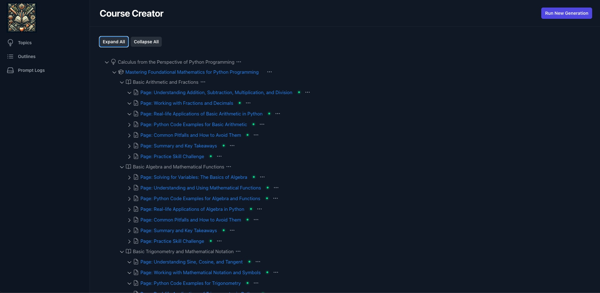
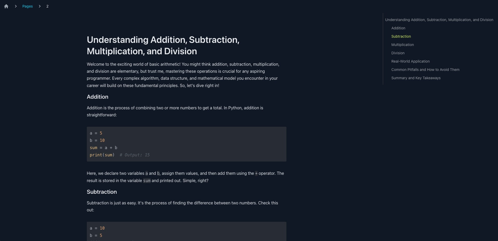
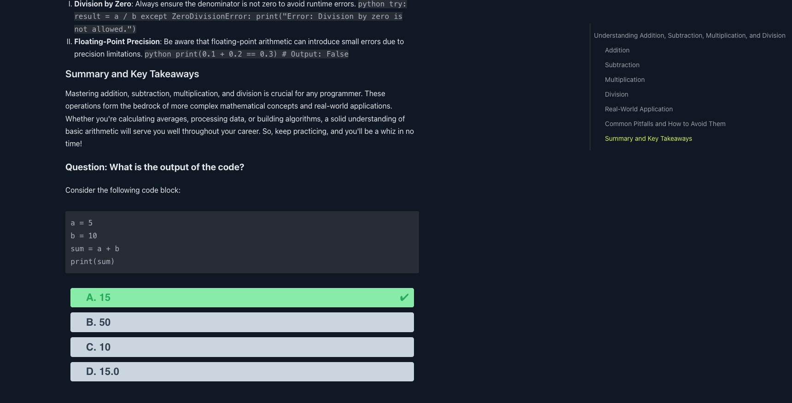
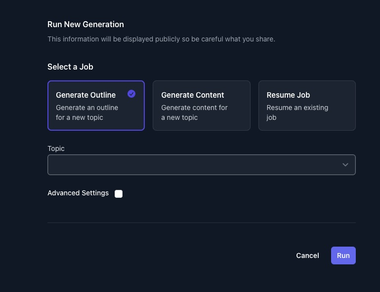
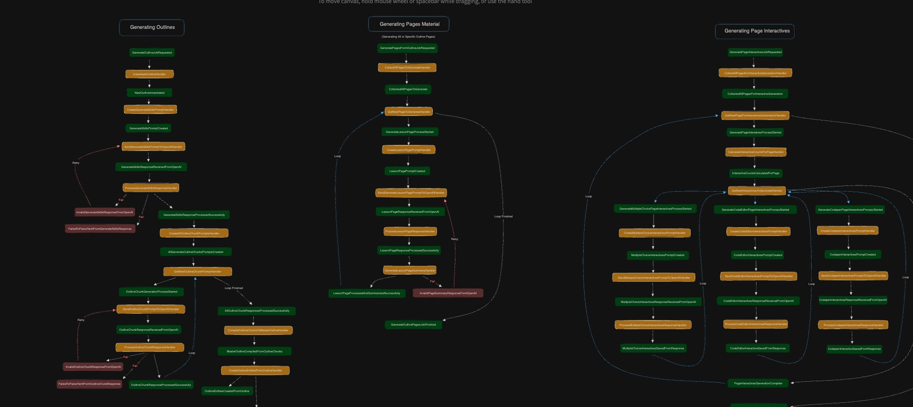

# AI Course Creator
## Create upwards of 60 hours of educational content, complete with practice questions, given a topic phrase.


- [AI Course Creator](#ai-course-creator)
	- [Create upwards of 60 hours of educational content, complete with practice questions, given a topic phrase.](#create-upwards-of-60-hours-of-educational-content-complete-with-practice-questions-given-a-topic-phrase)
	- [System requirements](#system-requirements)
	- [Setup](#setup)
	- [Quick Start](#quick-start)
		- [Open in Browser](#open-in-browser)
	- [Run New Generation](#run-new-generation)
		- [CLI Mode](#cli-mode)
		- [App Mode](#app-mode)
		- [Jobs](#jobs)
			- [Generate Outline](#generate-outline)
			- [Generate Page Material With Interactives](#generate-page-material-with-interactives)
			- [Generate Page Material Only](#generate-page-material-only)
			- [Generate Interactives](#generate-interactives)
			- [Compile Interactives (Optional)](#compile-interactives-optional)
			- [Resume Job](#resume-job)
	- [Under the Hood](#under-the-hood)
	- [Contributing \& Bug Fixes](#contributing--bug-fixes)


## System requirements
- Ensure Python version of `3.12` or higher. (*I personally recommend [pyenv](https://github.com/pyenv/pyenv) with the [virtualenv](https://github.com/pyenv/pyenv-virtualenv) extension*). Repo contains pyenv `.python-version` file with preferred version.
- Ensure Node is installed with version `18.x` or higher. `app/client` contains `.nvmrc` file with preferred version. 

## Setup
`git clone https://github.com/AlextheYounga/ai-course-creator.git`

`pip install -r requirements.txt` 

## Quick Start

Use the example sqlite database which contains 13 courses on "Calculus From the Perspective of Python Programming"

```bash
unzip storage/example/python-calculus.db.zip && mv database.db db/database.db
```

**Run `python run.py`**

Running this command will automatically create default config files including a default `.env` file, which is where we will store variables like our OpenAI API keys. Check this file and add your keys there. 

```bash
APP_ENV=development
LLM_CLIENT=OPENAI
OPENAI_API_KEY=your-open-api-key
DB_URL='sqlite:///db/database.db'
OUTPUT_DIRECTORY='out'
```

### Open in Browser
```
(ai-course-creator) M1:ai-course-creator alexyounger$ python run.py
[?] Select command category:
   Start Course Creator
   Utilities
 > Run App Server
```

This will install the required node packages, build the app, and then open the browser towards the correct localhost server.

Dashboard View


Page Content View


Content Interactive Questions


## Run New Generation
### CLI Mode
```
(ai-course-creator) ai-course-creator$ python run.py
[?] Select command category:
 > Start Course Creator
   Utilities
   Run App Server

[?] Which topic would you like to generate course material for?:
   Create New
   All
 > Ruby on Rails

[?] Select task:
 > Generate Outline
   Generate Page Material With Interactives
   Generate Page Material Only
   Generate Interactives
   Compile Interactives
   Resume Job
```

### App Mode
You can also run new generations from the frontend, although bear in mind that the CLI has been prioritized over the frontend application, and there may be some instabilities in this form. There is also currently no way to view the progress of a new generation from the frontend; this can only be viewed from the terminal. 



### Jobs
#### Generate Outline
Generate an outline of courses, their chapters, and pages, given a single topic. This will create a random number of courses, but can be as high as 25 courses.

#### Generate Page Material With Interactives
Generate page material for each page in the course, as well as create interactive question for practice challenges. Interactives will be generated based on the material in each page.
Kinds of interactive questions: 
- Multiple Choice
- Fill in the Blank (this may be broken)
- Code Editor 
  - These are currently not runnable. One item on the TODO list is to add [Judge0](https://judge0.com/) code execution to handle this. All of the information exists to make this runnable, and testable. 
- Codepen Embed
  - Is not runnable but allows for interactive components within programming course content 

#### Generate Page Material Only
Generate page material only, without interactives.

#### Generate Interactives
This will generate only interactives, but this is only possible if page material has been generated prior to this. Interactives are generated for each page. 

#### Compile Interactives (Optional)
Associate interactives with page material. This process happens automatically when generating page material with interactives, but there were times when I needed to run this process by itself, so I kept it. 

#### Resume Job
Cut a job short? Here's how you can keep it running where you last left off. (May contain a few bugs)

## Under the Hood
The Course Creator uses an event/handler architecture, events are associated with event handlers, and all managed in Redis queues. All event handlers are processed by Redis as if they are a distinct job with no knowledge of each other. This creates a kind of "state machine" system, where every single action can be accounted for. This is a very practical system for any complex AI-based architecture, and allows for easy maintenance as well as a near-infinite number of configurations and flows. 

The one tradeoff of this system: more code. More code is generally considered a no-no, but if you value *clarity above all, as I do, then this is an acceptable tradeoff. There is a lot of code, but it is very simple. If you want to create a new event-handler flow in order to facilitate a new feature, you can copy 80% of the code from another handler. 

Example Event: 
```python
# events.py
class GenerateSomethingFromLLMRequested(Event):
    def __init__(self, data, id=cuid()):
        super().__init__()
        self.id = id
        self.data = data

class ProcessResponseFromLLM(Event):
    def __init__(self, data, id=cuid()):
        super().__init__()
        self.id = id
        self.data = data
```

Example Handler:
```python
from src.events.events import ProcessResponseFromLLM

class GenerateSomethingFromLLMHandler:
    def __init__(self, data: dict):
        self.data = data
        self.db = DB()

    def handle(self) -> Outline:
		response = self._get_response_from_llm()
		# call another event
		return ProcessResponseFromLLM(self.data) 

    def _get_response_from_llm(self) -> dict:
		pass
```

Event Registry:
```python
# events_registry.py
EventRegistry.register(GenerateSomethingFromLLMRequested, GenerateSomethingFromLLMHandler)
EventRegistry.register(ProcessResponseFromLLM, ProcessResponseFromLLMHandler)
```

[Excalidraw of Event Handler Flow](https://excalidraw.com/#json=phzY33DD563eCRY5Du_kK,G0ozwD2bo2nOf1l8doX9eA)


## Contributing & Bug Fixes
I will always read pull requests. I may not always merge pull requests.
I definitely would love some help improving this. I will attempt to improve the documentation as time goes on. 